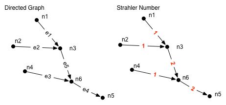

[List of Sewer Modules](Sewer.md)

#NetworkAnalysis

The module calculates the [Strahler](http://en.wikipedia.org/wiki/Strahler_number) number of a directed graph

##Parameter
|        Name       |          Type          |       Description         | 
|-------------------|------------------------|---------------------------|
| EdgeName         | string                 | name of the input network        |

##Datastream
|     Identifier    |     Attribute    |      Type             |Access |    Description    |
|-------------------|------------------|-----------------------|-------|-------------------|
| [EdgeName]        |                  | EDGE                  | read  | directed graph; edges need to share nodes |
|                   | strahler  | double | write | strahler number |

#Detailed Description

The algorithm requires the graph to be directed towards the root node. Also if edges are linked to each other they need to share the same node. e.g. End node of e1 is start node of e2.

